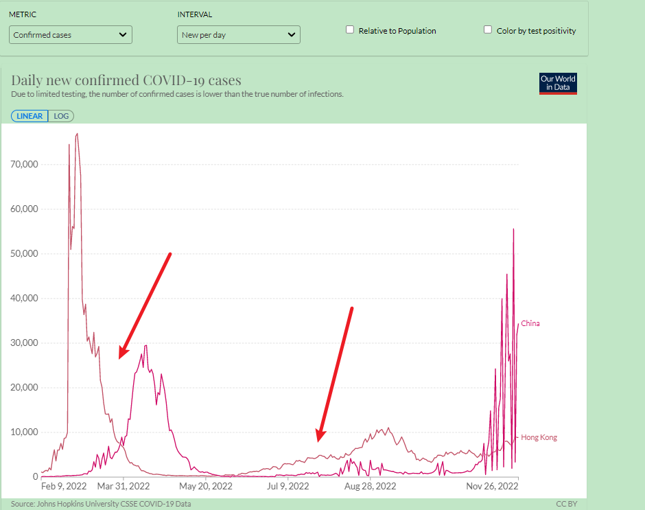

# 复必泰二价疫苗运抵香港


　中新社香港11月27日电 (记者 戴小橦)香港特区政府卫生署卫生防护中心27日公布，截至当日零时，香港新增8033宗新冠病毒阳性病例。12岁或以上合资格人士即日起可网上预约复必泰二价疫苗，并于12月1日起在香港各社区疫苗接种中心等地接种。

　　当日新增病例中，7530宗为本地病例，包括1571宗核酸检测阳性病例，5959宗快速测试阳性病例。另外还有503宗输入病例。香港医院管理局(医管局)公布，过去一天新呈报20名确诊病人在公立医院离世。

　　另外，首批约77万剂复必泰二价疫苗日前已运抵香港。特区政府27日宣布，12岁或以上合资格市民上午9时开始，可在网站上预约复必泰二价疫苗作为第四针，并于12月1日起在各社区疫苗接种中心等地接种。60岁或以上领取“即日筹”的合资格人士，可以现场选择接种二价疫苗或传统(原始病毒株)疫苗。但从未接种疫苗或未接种适当剂量的市民，不能选择二价疫苗。(完)



从新闻分析，复必泰二价疫苗， 12岁以下禁止，60岁以上自担风险，不作为基础针，只能作为加强针。 需要后续观察针后反应。 香港疫情平息，国内才会安定，从时间轴看2022年上 、下半年的疫情的起始点都是香港。

**从下图看，香港是先行指标，对香港的数据我个人表示怀疑。**

