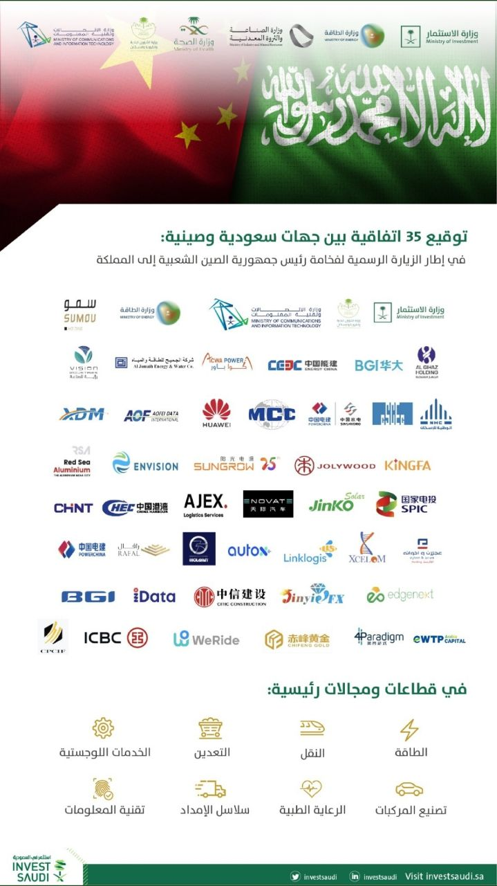
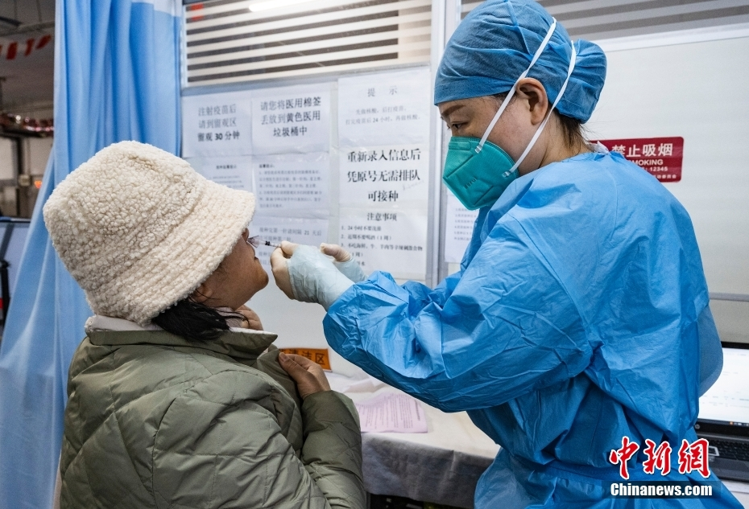

# 2022年日记


|  日期   | 新增本土新冠确诊病例 | 无症状感染者  |
|  :----:  | :----:  |:----: |
| 20221201 | 26 |209 |
| 20221202  | 27 |264|
| 20221203 | 36 |450 |
| 20221204| 41|524 | 
| 20221205| 41|536 | 
| 20221206| 24|454 | 
| 20221207| 39|327 | 
| 20221208| 28|303 | 
| 20221209| 13|259 | 
| 20221210| 4|197 | 
| 20221211| 11|120 | 
| 20221212| 14|115 |
| 20221213| 16|117 |  
| 20221214| 22| |





今天早上去做核酸，风很大，我的心情也不好。

市疫情防控工作领导小组办公室发布优化调整疫情防控的相关措施，具体如下：
一、乘坐轨道交通、地面公交、轮渡等市内公共交通工具，不再查验核酸检测阴性证明。
二、全市公园、景区等室外公共场所，不再查验核酸检测阴性证明。

抓紧时间补仓。 网购 ，广东、保定、石家庄货源暂停。

社交媒体， 共存占主流，少数拒绝，评论也是。 攻击科兴疫苗的谣言很多。同时看到美国指责中国不购买美国疫苗的新闻。





上海疫情数据继续上涨。

今天看到一篇高福的采访稿， 信息量很大。全文引用 。

福寿园的股价又涨了。

上海已入冬！

网上关于共存的假消息很多，已经开始怀疑公布的阳性数据。都和保定，石家庄，广东有关。





高福 新冠鼻喷多肽药物进入二期临床，未来疫情防控清病不清毒 

12月4日，中国科学院院士、中科院微生物所研究员、中国疾控中心原主任高福向第一财经记者证实，他的团队开发的一款抗新冠多肽药物即将进入二期临床试验。

第一财经记者了解到，这款名为HY3000鼻喷雾剂的抗新冠多肽药物，是中科院微生物所与翰宇药业共同开发的，是国内首个获批临床的预防新冠肺炎感染的广谱多肽药物。

12月2日，HY3000鼻喷雾剂正式获得南方医科大学珠江医院医学伦理委员会临床试验审查批件。高福表示，一期临床研究数据显示，这款药物具备高活性、高抗病毒效果，兼具广谱性和安全性。

随着国家进一步优化疫情防控工作的“二十条”措施出台，目前各地都开始实施推进优化细则。高福对第一财经记者表示：“新冠疫情防控二十条措施当中，我认为最重要的就是强调精准防控，号召大家把疫苗和药物准备好。”

在新冠疫情三年中，高福一直呼吁科学家和疾控部门需要花更多时间来培育公众的认知。“在应对疫情的过程中，科学循证、公众理解和参与以及行政决策三者不可缺一。”他对第一财经记者表示，“公共卫生事件的处理要有科学基础，而行政决策必须要务实。”

高福表示，两年前科学家们就已经预测“新冠病毒不会消失”，未来疫情防控的目标将强调“清病不清毒”。“也就是我们要把新冠疾病尽量控制住，而不是把病毒清除掉。”高福说道，“未来抗疫我们要坚持小步走不停步。”

他还强调，未来抗原检测试剂将会得到更广泛的应用。12月2日，中科院微生物所与江苏美克医学共同研发的一款新冠抗原检测试剂产品获得上市批复。

在总结应对新冠大流行中疫苗、抗体和药物的研发经验时，高福坦言：“我觉得一个从事基础 (科学) 研究的科学家同样可以做出解决实际 (技术) 问题的实用工作，如果能有产业部门 (工程) 的合作，一定可以做出解决国计民生问题的产品与商品。”

他提出，科学家有了基本的科研想法后，应该大胆提出“假说”，根据“假说”设计“实验”，验证想法，再基于实验结果形成初步的产品“概念”，发表论文，经同行评审后，再将其转化为“技术”和“样品”，如果样品被市场看好，可进一步与企业合作，获监管部门认可后，可形成最终的“产品”，进入市场，参与竞争，优胜劣汰，服务社会、造福人类。

高福还鼓励更多科学家和病毒学家投身于科普，把科学知识传播给大众，预防“信息流行病”。“相比新冠流行病而言，信息流行病的危害性更大。”他对第一财经记者表示。





台湾出现第二例人感染新型猪流感(H1N2v)病例，确诊者为一名7岁女童 ，又是RNA病毒。

调查指近八成上海老年人掌握了网上买菜、打车、挂号等知识和技能。

政府号召层层减码，每一层码后面都有一家公司， 现在开始重分配，定标准了。

人民币回6，十年期国债收益率升高。

万泰生物鼻喷能防BF7，反正看不到数据。

昨天看新闻，上海公共卫生临床中心推荐贵州百灵，今天去药店买了些药，百灵的咳嗽药水不在医保里。

中国物流与采购联合会：11月全球制造业PMI为48.7% ,这个能是政策转向的原因。

北京防疫政策继续放松，上海也在放松，我们小区核酸也通知不做了。社交媒体上看到北京透析群体表示焦虑，有批评胡锡进的声音，有对保定躺平态度不同的表达。





上海的数字，已经没有意义。 今天看到新闻，北京已经有小儿惊厥， 全家阳，专家说，流感小孩也会有高烧。 

从澳门发布的防疫政策看国家防疫政策， 逐步放宽；老人疫苗；清病不清毒；不允许出现大规模感染 ；健康的第一责任人。

我有种感觉，上海不会春节爆发吧。。。

国家新能源汽车补贴将终止退出。

个税专项附加扣除增加到7项了.

国务院联防联控机制发布《关于进一步优化落实新冠肺炎疫情防控措施的通知》 联防联控机制综发〔2022〕113号





上海的数据竟然降了。

习近平抵达利雅得出席首届中国－阿拉伯国家峰会、中国－海湾阿拉伯国家合作委员会峰会并对沙特进行国事访问 .非常了不起的大事，这两年国内不会太平静。

大众安徽首台预量产车型下线， 合肥和合肥周边，都是好地方。

万泰的鼻喷，昨天晚上看到， 大失所望，只能和针剂组合使用。

全国各地继续减码，也许社交媒体里混了不少假新闻，还是要做好个人防护。

今天去大菜场，花了1000多，把香肠，肉糜，排骨全都备齐，少数人不戴口罩且卫生习惯不好。 
看了新闻报道，当前为上海窗口期。。。





　　新冠病毒感染者居家治疗指南

　　一、适用对象

　　(一)未合并严重基础疾病的无症状或症状轻微的感染者。

　　(二)基础疾病处于稳定期，无严重心肝肺肾脑等重要脏器功能不全等需要住院治疗情况的感染者。

　　二、家居环境要求

　　(一)在条件允许情况下，居家治疗人员尽可能在家庭相对独立的房间居住，使用单独卫生间。

　　(二)家庭应当配备体温计(感染者专用)、纸巾、口罩、一次性手套、消毒剂等个人防护用品和消毒产品及带盖的垃圾桶。

　　三、管理要求

　　(一)社区(村)和基层医疗卫生机构工作要求。

　　1.建立联系。发挥各地疫情防控社区(基层)工作机制的组织、动员、引导、服务、保障、管理重要作用。基层医疗卫生机构公开咨询电话，告知居家治疗注意事项，并将居家治疗人员纳入网格化管理。对于空巢独居老年人、有基础疾病患者、孕产妇、血液透析患者等居家治疗特殊人员建立台账，做好必要的医疗服务保障。

　　2.给予指导。居家治疗人员根据说明书规范进行抗原检测，必要时可请基层医疗卫生机构给予指导。基层医疗卫生机构对有需要的人员给予必要的对症治疗和口服药指导。

　　3.协助就医。社区或基层医疗卫生机构收到居家治疗人员提出的协助安排外出就医需求后，要及时了解其主要病情，由基层医疗卫生机构指导急危重症患者做好应急处置，并协助尽快闭环转运至相关医院救治。要以县(市、区)为单位，建立上级医院与城乡社区的快速转运通道。

　　4.心理援助。以地市为单位建立畅通心理咨询热线。基层医疗卫生机构和社区要将心理热线主动告知居家治疗人员，方便其寻求心理支持、心理疏导帮助。对于发现的心理或精神卫生问题较严重者，可向本地(市、县)精神卫生医疗机构报告，必要时予以转介。

　　5.个人防护。与居家治疗人员接触时，应当做好自我防护，尽可能保持1米以上距离。

　　(二)居家治疗人员自我管理要求。

　　1.健康监测和对症治疗。居家治疗人员应当每天早、晚各进行1次体温测量和自我健康监测，如出现发热、咳嗽等症状，可进行对症处置或口服药治疗。有需要时也可联系基层医疗卫生机构医务人员或通过互联网医疗形式咨询相关医疗机构。无症状者无需药物治疗。居家治疗人员服药时，须按药品说明书服用，避免盲目使用抗菌药物。如患有基础疾病，在病情稳定时，无需改变正在使用的基础疾病治疗药物剂量。

　　2.转诊治疗。如出现以下情况，可通过自驾车、120救护车等方式，转至相关医院进行治疗。

　　(1)呼吸困难或气促。

　　(2)经药物治疗后体温仍持续高于38.5℃，超过3天。

　　(3)原有基础疾病明显加重且不能控制。

　　(4)儿童出现嗜睡、持续拒食、喂养困难、持续腹泻或呕吐等情况。

　　(5)孕妇出现头痛、头晕、心慌、憋气等症状，或出现腹痛、阴道出血或流液、胎动异常等情况。

　　3.控制外出。居家治疗人员非必要不外出、不接受探访。对因就医等确需外出人员，要全程做好个人防护，点对点到达医疗机构，就医后再点对点返回家中，尽可能不乘坐公共交通工具。

　　4.个人防护。居家治疗人员要做好防护，尽量不与其他家庭成员接触。如居家治疗人员为哺乳期母亲，在做好个人防护的基础上可继续母乳喂养婴儿。

　　5.抗原自测。居家治疗人员需根据相关防疫要求进行抗原自测和结果上报。

　　6.感染防控要求。

　　(1)每天定时开门窗通风，保持室内空气流通，不具备自然通风条件的，可用排气扇等进行机械通风。

　　(2)做好卫生间、浴室等共享区域的通风和消毒。

　　(3)准备食物、饭前便后、摘戴口罩等，应当洗手或手消毒。

　　(4)咳嗽或打喷嚏时用纸巾遮盖口鼻或用手肘内侧遮挡口鼻，将用过的纸巾丢至垃圾桶。

　　(5)不与家庭内其他成员共用生活用品，餐具使用后应当清洗和消毒。

　　(6)居家治疗人员日常可能接触的物品表面及其使用的毛巾、衣物、被罩等需及时清洁消毒，感染者个人物品单独放置。

　　(7)如家庭共用卫生间，居家治疗人员每次用完卫生间均应消毒；若居家治疗人员使用单独卫生间，可每天进行1次消毒。

　　(8)用过的纸巾、口罩、一次性手套以及其他生活垃圾装入塑料袋，放置到专用垃圾桶。

　　(9)被唾液、痰液等污染的物品随时消毒。

　　四、结束居家治疗的条件

　　如居家治疗人员症状明显好转或无明显症状，自测抗原阴性并且连续两次新冠病毒核酸检测Ct值≥35(两次检测间隔大于24小时)，可结束居家治疗，恢复正常生活和外出。

　　五、保障要求

　　(一)各地疫情防控领导机制中负责社区(基层、农村)工作的牵头单位要充分发挥作用，切实担当负责。基层医疗卫生机构建立24小时值班制度，指定专人承担感染者居家治疗健康咨询工作。社区(村)安排做好核酸检测、垃圾清运、环境消杀等工作，并及时发现和解决问题。

　　(二)要组织医疗机构，通过远程指导、互联网医疗等线上+线下相结合的方式，为居家人员提供康复指导支持和心理支持，基层医疗卫生机构通过互联网等多种方式加强对辖区居家康复人员的巡查指导和健康监测，二、三级医院要通过远程医疗的方式为基层医疗机构提供会诊指导。

　　(三)各地要加强基层医疗卫生机构常用药品、抗原检测试剂、指夹式血氧仪等储备，切实满足居家治疗人员用药和健康监测需求。

　　(四)医疗机构要严格落实首诊负责制和急危重症抢救制度，不得以任何理由推诿或拒绝居家治疗的新冠病毒感染者特别是急危重症患者到医疗机构就诊。

附件1

　　新冠病毒感染者居家治疗常用药参考表

附件2

　　新冠病毒感染者居家治疗抗原检测指南

　　一、检测试剂获得

　　1.居家治疗人员可通过药品网络销售电商等购买抗原检测试剂，也可通过所在的社区(村)或辖区基层医疗卫生机构协助购买抗原检测试剂。

　　2.社区(村)和基层医疗卫生机构要为辖区内有需求的居家治疗人员，特别是老年人，提供获得抗原检测试剂的便利。

　　二、检测和结果判读

　　1.居家治疗人员可以按照说明书要求和流程自行进行检测和结果判读，也可以联系基层医疗卫生机构签约服务医务人员，在其远程指导下完成检测和结果判读。

　　2.养老机构工作人员要在有需要时，按照说明书要求和流程为养老机构内的老年人进行抗原检测和结果判读。





今天上海的新冠数据依然那么奇怪。 

这两天海关进出口数据，如果是前11月总的数据不错，如果但看11月数据，那是很差。 台湾的出口数据也很差。 难怪浙江，江苏都出去抢订单。

头条上信息真假难辨。消息基本集中在北京，保定和广州的新闻在减少。

国务院联防联控机制：确保孕产妇、儿童急诊急救绿色通道畅通。

11月 cpi 1.6 . 

全球首架C919正式交付中国东方航空。

今天看了德国知事的节目，才知道所谓参加德国政变是25个老人。。。。。。

原文引用 “警惕，它们正在篡改我们的集体记忆”

中沙投资项目 。





官宣 ！ 充分利用上海石油天然气交易中心平台 ，开展油气贸易人民币结算  。上海又躺赢了. 

中国水利部部长：中国已超采地区地下水水位止跌回升.





中国国务院总理李克强9日在安徽省黄山市同世界银行行长马尔帕斯、国际货币基金组织总裁格奥尔基耶娃、世界贸易组织总干事伊维拉、经济合作与发展组织秘书长科尔曼、金融稳定理事会主席诺特和国际劳工组织总干事洪博的特别代表李昌徽在举行第七次“1+6”圆桌对话会后共同会见记者 .

头条上看到北京有小孩死亡 ，不知道真假。 

曾光：对回归正常生活要有信心，更要有耐心 





上海市疫情防控工作领导小组办公室发布持续优化调整疫情防控的相关措施，除养老机构、儿童福利机构、医疗机构、学校(含托幼机构)等特殊场所外，上海市其余场所不再要求查验“随申码”等健康码，不再要求扫“场所码”(含“数字哨兵”)。

北京数据 : 12月11日，全市发热门诊就诊患者2.2万人次，是一周前的16倍。



 

 优化疫情防控“新十条”的出台，持续提高了防控的科学精准水平，在最大程度保护人民群众生命安全和身体健康的同时，也最大限度减少了疫情对群众生产生活秩序和经济社会发展的影响。随着“新十条”的出台，各地陆续将核酸检测、隔离、风险区划定等关键防控措施向更为科学的方向调整，关于将新冠肺炎从“乙类传染病甲类管理”调整为“乙类传染病乙类管理”的观点也开始被一些学者热议。将施行近3年的新冠“乙类甲管”回调至“乙类乙管”时机是否成熟？新冠肺炎降级为“乙类乙管”是否意味着我们可以彻底回归正常生活？中国疾病预防控制中心流行病学前首席科学家曾光日前在接受《环球时报》记者专访时表示，是否调整取决于我们对病毒特点的科学认识是否达成共识，对于回归正常生活，我们要有信心，更要有耐心。

　　“何时可降级管理”引发讨论

　　2019年12月底，新冠肺炎疫情突袭我国。2020年1月20日，国家卫健委发布1号公告称，根据《传染病防治法》的相关规定，基于当时对新型冠状病毒感染的肺炎的病原、流行病学、临床特征等特点的认识，报国务院批准同意，将新型冠状病毒感染的肺炎纳入法定传染病乙类管理，采取甲类传染病的预防、控制措施。自此开启了长达将近三年的新冠肺炎“乙类甲管”抗疫之路。

　　2020年1月，曾光作为国家卫健委高级别专家组成员两赴武汉开展防疫调研，谈及新冠肺炎最初的管理分类，曾光近日对《环球时报》表示，新冠肺炎之所以最初划归到“乙类传染病甲类管理”，主要是因为疫情早期病毒来势汹汹，传播快、病死率高。现在看来这种管理方式是科学且必要的，“正是由于我国的依法管理，对策及时、正确，才保障了社会防控卓有成效地开展，取得了举世瞩目的阶段性成果”。

　　截至目前，新冠病毒已从最初的原始毒株，平行进化出了阿尔法、贝塔、伽马、德尔塔，以及奥密克戎等变异株，眼下奥密克戎变异株及其进化分支成为优势流行株。国内外的大量研究显示，整体而言，奥密克戎变异株呈现出传播力强、传播范围广，但致病力显著减弱的特点。

　　在临床研究层面，国务院联防联控机制组织呼吸危重症专家童朝晖近日表示，奥密克戎导致的住院率、重症率、病死率都在大幅降低。从当前全国病例来看，感染奥密克戎后以上呼吸道症状为主，主要表现为嗓子不舒服、咳嗽等。无症状和轻型大约占了90%以上，普通型（出现肺炎症状）已经不多，重症（需要高流量氧疗或接受无创、有创通气）的比例更小。

　　根据当前疫情形势和病毒变异情况，为更加科学精准地开展疫情防控，国务院联防联控机制近日出台疫情防控“新十条”，其中“按楼栋、单元、楼层、住户划定高风险区，不得采取各种形式的临时封控”，以及“允许轻症病例、无症状感染者和密切接触者自行居家隔离”等规定，在事实上进一步缩小了管控范围，因而被舆论认为逐渐在向“乙类传染病乙类管理”靠拢。一些学者因此也认为应将新冠肺炎调整到“乙类乙管”。

　　对此，曾光认为，将新冠肺炎回归到“乙类乙管”，从近期看，应当是一个基于科学凝聚共识的过程。当前，随着新冠病毒不断向高传播力、低病死率方向转化，正由肺炎转化为上呼吸道感染，绝大多数为轻症和无症状感染者，一旦学术界确认这种变化趋势已经稳定，达成共识，相信国家会在适当的时候调整传染病管理的类别。

　　将新冠肺炎从“乙类甲管”调整至“乙类乙管”意味着什么？曾光告诉《环球时报》记者，如果将新冠肺炎按照乙类传染病管理，就意味着将对新冠肺炎的管理回归到卫生系统的常规工作，依然要诊断、报告、管理每一例病例，可以对病人和密切接触者依法隔离，对污染的疫源地消毒，但不再由政府组织大规模的社区封控、中断交通等措施。疫情防控将解除临时的应急管理状态，而回归到传染病的常态化管理阶段。

　　“乙类甲管”降为“乙类乙管”有先例

　　“依据《中华人民共和国传染病防治法》，依法管理的传染病分甲、乙、丙三类，但需要指出的是它们都是对国民健康造成严重危害的传染病，都要贯彻‘预防为主’的方针，实施‘控制传染源，切断传播途径，保护易感人群’的公共卫生基本原则。”曾光在接受《环球时报》记者专访时详细介绍称，我们对于甲类传染病，需要采取强制性的社会管控对策，不但要管理好每一例病例，如果需要还可以依法强制隔离密切接触者，实行大规模的社会防控，以防止疫情播散。对于乙类传染病，管理措施则相对宽松。曾光表示，对于乙类传染病我们只需要报告、诊疗、管理好每一个病例，实施必要的隔离和消毒措施，这些都属于疾控部门和临床医生的常规工作，不必采取较大规模的社会防控措施。而丙类传染病，发病率虽然可能很高，但绝大多数为轻症病例和无症状感染者，病死率低，曾光认为，此时就没有可能、也没有必要花费巨大的社会成本诊断、管理每一例病例。因此丙类传染病属于监测管理的传染病，我们只需要及时发现并抢救危重病例，动态监测疫情演变趋势、病原体变异和耐药性变化，指导实施有效的预防对策，如接种流感疫苗、研发抗病毒药物等。

　　曾光介绍称，2003年应对“传染性非典型肺炎”，2009年应对导致世界大流行的“新型H1NI流感”，以及2020年我国应对新型冠状病毒肺炎都采取了“乙类甲管”。此前已有的经验是随着病原体的演变和疫情管控的需要，我们可以在适当时候，将“乙类传染病甲类管理”降级调整为“乙类传染病乙类管理”，不再按甲类管理，甚至最终可以调整为“丙类传染病丙类管理”。

　　《中华人民共和国传染病防治法》对传染病的调级也有明确规定，其中第三条指出，国务院卫生行政部门根据传染病暴发、流行情况和危害程度，可以决定增加、减少或者调整乙类、丙类传染病病种并予以公布。第四条则指出，需要解除依照前款规定采取的甲类传染病预防、控制措施的，由国务院卫生行政部门报经国务院批准后予以公布。

　　“我国在2003年战胜非典疫情后，仅名义上依然在列‘乙类甲管’，但已无甲管之实。还有2009年入夏以后，随着‘新型H1NI流感’的致病力大幅下降，我国也采取了将管理类别分两步降级的模式，先是调整为乙类传染病乙类管理，不再按甲类管理，后来进一步调整为丙类传染病丙类管理，纳入流感的管理栏目，不再单列。”曾光介绍称。

　　“这是极为关键但艰难的一步”

　　随着第九版防控方案、疫情防控二十条优化措施以及“新十条”的陆续出台，疫情防控措施本着“小步走、不停步”的原则，朝着更精准、更科学的方向逐渐提升，广大人民群众似乎也看到了逐渐回到疫情前生活状态的希望。

　　虽然，目前疫情的防控措施正在更加精准，社会的流动性也在提升，但曾光认为，目前正处于新冠发病率急剧上升的时候，因此还不能轻言可以回归到正常生活，只有经过新冠疫情的冲击，待疫情稳定下来，当对待新冠只须像对待流感一样实施监测管理，不再报告管理一般病例，而是把重点放在抢救重症病例、接种疫苗和加强个人防护上时，才能将新冠肺炎调整到丙类传染病管理，大家才能回归到正常生活。

　　“在新冠肺炎防控政策的调整过程中，从乙类甲管调整至乙类乙管，是极为关键但艰难的一步，这种调整意味着对于新冠肺炎管理发生了质的变化，一旦调整到乙类管理，未来再降到丙类传染病管理，那就是水到渠成的事情了，我相信新冠肺炎最终也会降为丙类丙管的，对此我们要有信心，更要有耐心。”曾光称。

 



中新网北京12月12日电 (徐婧)12月7日以来，北京市在院诊断新冠感染者数量及核酸检测数量均呈下降趋势。同期，发热门诊就诊量和流感样病例数明显攀升，120急救呼叫量急剧增长。从新冠病毒传播的速度和波及的范围上看，当前北京市疫情快速扩散蔓延的趋势仍然存在。

北京市卫生健康委员会副主任、新闻发言人李昂在12日的疫情防控工作新闻发布会上表示，该委会同有关部门，结合“新十条”措施采取一系列工作举措，努力解决市民近期看病就医中出现的问题。

　　北京疫情快速扩散蔓延趋势仍存在

　　李昂介绍，12月7日国务院联防联控机制“新十条”发布以来，北京市积极部署落实，细化配套政策，努力促进优化调整措施平稳有序落地。疫情防控政策优化调整后，大量新冠病毒感染者选择居家康复，全市在院诊断新冠感染者数量及核酸检测数量均呈下降趋势，同期，发热门诊就诊量和流感样病例数明显攀升，120急救呼叫量急剧增长。

　　他表示，12月11日，全市发热门诊就诊患者2.2万人次，是一周前的16倍。12月5日至11日流感样病例监测数据显示，全市二级以上医院监测流感样病例数1.9万人，较上一周上升6.2倍。120急救电话呼入量急剧增加，12月9日达到高峰，24小时呼入量3.1万次，达到常态时的6倍。同期，全市方舱医院和定点医院入院量持续下降，出院量持续增长。12月8日至11日，全市方舱医院和定点医院共入院5517人，出院2.1万人；日入院人数从1762人降至1064人，日出院人数从4723人增长至5061人；方舱医院床位使用率明显下降，从12月8日的56.3%降至11日的32.3%；定点医院床位使用率从66.7%降至58%。

　　李昂指出，从新冠病毒传播的速度和波及的范围上看，当前北京市疫情快速扩散蔓延的趋势仍然存在。疫情的快速发展导致医疗服务在短期内面临较大的压力。为有效保障市民就医需求，北京市卫生健康委会同有关部门，结合“新十条”措施采取一系列工作举措，努力解决市民近期看病就医中出现的问题。

　　全市医院发热门诊增至303家

　　李昂介绍，北京推进发热门诊建设。针对市民近期反映较突出的医院发热门诊就医难问题，迅速部署全市发热门诊和诊室扩面增容，要求二级以上医院和有条件的基层医疗机构均要开设发热门诊或诊室，增派人员力量。

　　目前，北京市医院发热门诊从94家增长至303家，全市全部二级以上医院均开设发热门诊或诊室，其中24小时开诊的235家，可接诊发热儿童的100家。全市349家正式运行的社区卫生服务中心全部设立发热诊区，为有发热等11类症状的患者提供诊疗服务(名单已由各区发布)。为方便市民查询，该委已通过官方网站、健康北京微信公众号等政务新媒体向社会公布了二级以上医院发热门诊(诊室)地址、电话及接诊发热儿童的相关信息。为避免集中至个别大医院就医导致排队拥挤，建议市民就近就便优先选择社区卫生服务中心就医。

　　他表示，市卫生健康委将会同各区对发热门诊开诊情况持续督导检查，也欢迎市民在就医过程中对发热门诊的工作提出意见建议。

　　北京急救中心扩容120调度指挥系统

　　李昂表示，北京强化院前急救工作。对12月9日的120急救电话呼入分析显示，咨询和重复拨打电话的约占八成，要车电话约占两成，要车电话中涉疫人员非急危重症转运需求持续升高。为了应对电话呼入高峰，北京急救中心扩容120调度指挥系统，调整接听调派模式，优化调派流程，调整人员班次，补充力量增加120接听受理坐席。要求各区成立非急危重症转运专班，设立救助转运电话，保留爱心车队、转运专班，统筹调配非急救转运车组，分流非急危重症需求。同时，加大120急救电话应用场景宣传，鼓励无症状和轻症患者在保障安全的情况下通过自驾车等方式就医，要求各区公布就医咨询电话为群众答疑解惑。

　　他称，在广大市民的支持配合下，12月11日120电话24小时呼入量较前一日下降约18%。北京将继续全力以赴支持120急救服务，保障急危重症救治需求，推进就医咨询服务，也希望市民朋友继续理解支持和配合我们的工作，合理使用120急救电话，咨询就医、非急危重症等情况不拨打120，为急危重症患者让出生命热线。

　　北京167家医疗机构可提供线上服务

　　李昂介绍，北京完善分级诊疗服务体系。按照“健康监测、分类管理、上下联动、有效救治”的原则，线上线下相结合，完善新冠肺炎患者分级诊疗服务网络。轻症和无症状感染者居家隔离康复，症状加重时可就近至社区卫生服务机构就诊，病情较严重、超出基层诊疗能力的患者，根据病情至辖区二三级医院就诊，必要时转诊至市级定点医院。

　　北京充分发挥互联网诊疗等信息技术支撑作用，全市互联网医院44家，开展互联网诊疗服务的医疗机构167家，可为患者提供线上服务。制定新型冠状病毒感染者居家康复专家指引、社区健康管理专家指引、居家康复实用手册，指导感染者居家康复期间自我健康管理。通过线上线下结合的方式，结合实际情况为感染者提供健康咨询、远程诊疗、转诊指导等服务，推进开展重点人员情况摸排。

　　李昂称，当居民出现发热、咳嗽等症状，居家治疗不见好转时，可首选居住地附近的社区卫生服务中心就诊，或联系家庭医生寻求帮助。目前，各区已公布本区家庭医生(团队)及其负责提供服务的社区(村)范围和联系方式。如果尚未签约家庭医生服务，可通过社区网格化服务途径，及时联系查找本社区家庭医生(团队)，医务人员将根据您的症状和相关情况给出具体指导意见。同时，对于辖区高龄、行动不便等感染新冠病毒的老年人，在开展健康评估的基础上，社区医务人员可提供上门巡诊或协助转诊。

　　出现发热等症状时不要恐慌 首选居家休息

　　北京加强合理用药指导。李昂表示，近期，很多市民在医疗机构和药店排队开药购药，购药的重点主要集中在“连花清瘟”“布洛芬”等国家卫生健康委第九版诊疗方案中推荐的药品品种。为加强合理用药指导，市卫生健康委组织药学、临床和中医专家，结合北京市气候特点，参考本轮疫情用药诊疗实际，制定北京市《新冠病毒感染者用药目录(第一版)》(目录单独发布)。

　　他称，用药目录是对第九版诊疗方案中推荐用药的完善和补充，将清热、解毒、排湿等功效的中药具体到药品品种；采取中西药分开的原则，针对发热、咽痛等6类中医诊断症状推荐67个中药品种，针对咳嗽咳痰等4类临床症状推荐41个西药品种。108个中西药药品都有各自的治疗特点，也有很多OTC(非处方类)药品，市民可以在医院以外，根据自身症状需求从零售药店、电商平台等多种渠道购买，根据说明书合理使用药品，没有症状不要吃药。如症状加重或在居家康复药物使用方面存在疑问，可就近在社区卫生服务中心进行诊疗并进行用药咨询。

　　李昂在发布会上提示，新冠病毒的致病性减弱，广大市民无需对病毒“谈虎色变”，出现发热等症状时不要恐慌，首选居家休息、合理用药、自我康复，如症状持续加重及时到医疗机构就诊。近期医疗机构发热患者较多，前往医疗机构就诊时务必做好个人防护。为了避免大量人群集中感染导致疫情高峰，对正常生产生活和就医秩序产生较大影响，在现阶段仍需尽可能减缓疫情的传播扩散，通过适当的防护和管理措施减少疫情对正常社会秩序的影响，有序、平稳实现防控策略的转换。

　　他提示市民继续坚持戴口罩、勤洗手、少聚集，使全社会能更快更好地恢复正常生产生活秩序。(完)





上海停止随申码和行程码。三大电信运营商删除行程码数据。

今天社交媒体传， 广州的是毒株是 BF5， 北京的BF7， BF7 更厉害。

媒体人得病轻症住医院单间了。 疫情众生相，北上广深的媒体人，只谈利不谈德。





将减少社交媒体时间， 他们都在演。

中国专家：新冠病毒几乎不会从孕妇传染给胎儿 。

海南省营商环境建设厅揭牌成立。





国家卫健委网站消息，13日，国务院应对新型冠状病毒肺炎疫情联防联控机制综合组印发《新冠病毒疫苗第二剂次加强免疫接种实施方案》.

看了疫苗清单，大多数为第一代疫苗，比较特殊的是万泰鼻喷，威斯克的是二代疫苗。

国家统计局：取消15日国民经济运行情况新闻发布会，改为网络发布 。

从朋友圈得知安徽2线城市开始阳， 有年轻人边阳边看电影。





最后一批医疗物资已经到货，安心过疫情。

个人销售抗原试剂违法最高可判无期徒刑,抗原检测试剂不同于口罩,2020年3月30日，国家药品监督管理局发布《中国对新型冠状病毒检测试剂和防护用品的监管要求及标准》，将新型冠状病毒检测试剂作为第三类医疗器械管理。个人不能从事第三类医疗器械(包括第二类)经营活动，个人在朋友圈等网络平台销售新冠抗原试剂盒是违法行为！

中联重科行业首创智慧工地 实现全流程自主全无人施工.

原单位同事开始出现阳性。

上海发布不再更新核酸数据。

北京地区开打第四针。

看到一片很有实践意义的文章转载，4位感染过新冠病毒的医生分享感染经历并给出建议

河南：从现在起至明年3月底 全省卫生健康系统取消节假日。

国务院联防联控机制印发《加强农村地区新冠肺炎疫情防控和健康服务工作方案》




    来源：新京报 

　　4位感染过新冠病毒的医生分享感染经历并给出建议

　　“感染新冠病毒不是一件很可怕的事情”

　　近期，不少地方新冠病毒感染者数量增加，越来越多的人开始在朋友圈、微博等社交平台分享自己的感染经历。感染新冠后，同住者如何注意防护？感染新冠后为什么会感觉浑身疼？发烧后“捂汗”有没有科学依据？肝病患者应如何选用退烧药物？带着这些疑问，12月14日，新京报记者连线感染过新冠病毒的中国中医科学院望京医院骨科主任医师温建民、北京朝阳医院神经外科主任医师汪阳、首都医科大学宣武医院神经外科主治医师陈思畅、中日友好医院普外科肝胆胰外科主任杨志英。四位医生分享了自己的感染经历，并给出应对新冠的建议。

　　中国中医科学院望京医院骨科主任医师温建民

　　要增加营养 保持蛋白质的摄入

　　新京报：请分享一下你的感染症状和痊愈经历。

　　温建民：我是12月1日凌晨确诊的，也不慌，我觉得迟早得感染。三年了，病毒越变越弱，我也治疗过一些新冠肺炎病人，知道他们是怎么扛过来的。我有一个对症的药方，之前也抓好了药放在家里，于是就开始吃中药，以清热解毒、利咽和止咳为主。

　　12月1日下午3点，我开始发烧，逐渐到了39℃，流鼻涕、浑身关节疼痛、头痛、咽痛。12月2日上午，烧到38.5℃左右，3日上午就不烧了，浑身疼的症状也好多了，只是还会咽干、咽痛、声音嘶哑。之后一天比一天好，现在是阴性。

　　新京报：头痛怎么缓解？

　　温建民：我头痛不厉害，可以忍。但我建议，如果伴有发烧的话，可以吃非甾体类止痛药，比如布洛芬。如果还想吃中药的话，建议和西药分开吃。

　　新京报：从感染到康复，有什么经验可以分享？

　　温建民：要增加营养，每天吃一到两个鸡蛋，保持蛋白质的摄入。要重视中医药早期干预，要对症。我的症状是典型的“寒包火”，天气冷，外头寒，身上热，给捂住了，所以我用中药来清里热。分清是“寒症”还是“热症”很重要，“寒症”主要是头疼、流清鼻涕，可以吃感冒疏风丸。现在“热症”比较多，主要是头疼、鼻涕和痰发黄，喉咙干疼，小便黄，也就是“寒包火”，可以用连花清瘟胶囊，加上清感颗粒。但不要过度吃药，也不要心急。

　　新京报：老年人如何提高免疫力？

　　温建民：平时喝点西洋参水，别总宅在家，多走、多运动、多喝水，但心脏和肾脏有问题的人也要量力而行。

　　新京报：感染期间，你和家人是如何隔离的？

　　温建民：我们分开睡，在家戴N95口罩，除了吃饭、上厕所，我尽量在我的屋子里待着，我们轮流去餐厅吃饭。一天通三次风，也要给空气消毒，喷一些75%酒精，紫外线灯也可以，如果家里有两个厕所的话，可以分开用。我爱人一直是阴性。

　　北京朝阳医院神经外科主任医师汪阳

　　不要同时吃基础病药物和退热药物

　　新京报：请分享一下你的感染症状和痊愈经历。

　　汪阳：上周三确诊，当天晚上就感觉咽喉不舒服，我扁桃腺本来就很容易发炎。但没有发烧，主要是头疼、肌肉疼、双侧腰痛，大概持续了四到五天。我吃了对乙酰氨基酚来止痛，也在家泡脚，有一定效果。现在，还有些咳嗽、嗓子痒、流鼻涕，但疼痛基本没有了。

　　新京报：有人发热后感觉神经疼痛，是什么缘故？

　　汪阳：其实更多见的是肌肉痛。神经痛一般指局部的(疼痛)，比如三叉神经痛。前两天我看了一篇文章，提到了新冠肺炎和疼痛的关系，文章说大概有70%多的新冠患者出现疼痛，主要表现为头痛、肌肉痛和肢体痛，这都在外周痛的范畴里，真正引起神经痛的只有7%多一点。

　　引起外周痛的原因，主要是病毒的损害，或病毒刺激机体释放一些活性物质引起的，再就是发热引起的乳酸沉积、引起酸痛。神经痛的主要原因是病毒对神经的损害，因为新冠病毒有一定嗜神经性，容易结合神经组织。

　　文章还做了一个分析，哪些是疼痛的危险因素，一个是男性，男性患者出现疼痛的比例要高些；第二个就是高的BMI指数(身体质量指数，又称体重指数)，肥胖的人疼痛会重一些；第三个，疼痛程度和感染严重程度是相关的。

　　新京报：有网友说，嗓子很疼，串得耳朵眼都疼，这个和神经痛有关吗？

　　汪阳：可能和神经有关，嗓子和内耳都是三叉神经支配，有可能是病毒对三叉神经的损害引起的。

　　新京报：如何缓解疼痛？

　　汪阳：一般来说可以吃布洛芬，有基础疾病的、吃阿司匹林的患者，可以吃对乙酰氨基酚、洛索洛芬。如果急性疼痛转为慢性疼痛，可以来医院就诊。

　　新京报：对于有脑血管基础病、糖尿病、心脏病、肿瘤等患者，有何用药建议？

　　汪阳：我看了一篇文章，作者分析了亚洲人群中新冠肺炎和脑卒中的关系，结论是新冠会加重卒中病人不良预后的比例。所以对脑血管疾病患者来说，首先要控制好原发病。在药物使用方面，因为脑血管病人一般吃阿司匹林或华法林等药物，这两种药物和布洛芬有协同作用，会增加出血风险，所以这些病人尽量选用对乙酰氨基酚，减少不良作用。糖尿病病人也优先选择对乙酰氨基酚。但如果手边只有布洛芬的话，建议和平时的药物间隔2小时再吃。

　　心脏病患者，特别是严重心功能不全、心衰病人，不建议吃布洛芬，也主张选择对乙酰氨基酚。

　　高血压，冠心病病人，慎用复方类制剂，很多这类药物里有麻黄碱或伪麻黄碱，都是收缩血管的，会引起血压升高。用这种制剂时，要看清楚里面的成分。

　　有肝脏疾病、肝脏功能不全的患者，不适合用对乙酰氨基酚，因为它是通过肝脏代谢的，适合用布洛芬。肾脏疾病患者，优选对乙酰氨基酚。不要同时吃基础病药物和退热药物，间隔半小时甚至2小时以上是比较理想的。

　　新京报：老年人居家治疗，哪些情况需要及时就医？

　　汪阳：对老人来说，新冠引起了持续性高热，超过24小时降不下来就要就医。如果出现呼吸困难、胸闷、或者血氧饱和度掉到了90以下，也要去医院。再就是如果出现卒中，突然偏瘫，不能说话、一边手脚不能动，也要抓紧去医院。

　　新京报：很多人对感染新冠病毒比较担心，有什么建议给大家吗？

　　汪阳：我感觉感染新冠病毒不是一件很可怕的事情，能防则防，能不得则不得，如果得了，也不要太紧张，多数年轻人肯定要扛过发烧的一两天，这是一个过程，不要指望到医院能开出一个神奇的药物，立马好，多数通过自身抵抗力、加一些药物、多喝水、好好休息就能缓解。有基础疾病的更不要紧张，把基础疾病控制一下，度过了发病早期，就会好转。就我自己和同事的经历而言，6天左右会完全康复，能正常工作。

　　首都医科大学宣武医院神经外科主治医师陈思畅

　　发烧时发冷要捂 体温升高后要散热补水

　　新京报：请分享一下你的感染症状和痊愈经历。

　　陈思畅：我是我的社交圈里第一个阳性的。上上周日确诊，当天就是嗓子有点干痒。第二天开始头疼，烧到39℃，吃了药很快能退烧，但是过一会儿又会烧起来。身体感觉很冷，我盖了三层被子，开着空调，再就是腰很疼，得不停贴膏药。第三天，我发高烧到40℃，腰、脖子、手腕都疼。那两天我还做了一点力量型锻炼，但是稍微用点劲就觉得胸口憋，喘不上气，所以不建议大家在发烧的时候剧烈运动，要多休息。第四天是低烧，浑身有力气了，但是嗓子剧烈疼痛，像在吞狼牙棒一样，照镜子时发现扁桃体表面是出血的，一咳嗽也有血。第六天抗原阴性，核酸阳性。第七天，核酸也阴性了。

　　新京报：大家都说发烧后要“捂汗”，这有道理吗？

　　陈思畅：“捂”是为了出汗散热。前期发冷的时候要捂，缩短体温上升的过程，体温捂上去之后，出汗主要是靠药物，然后就不要捂了，要注意散热和补水。

　　新京报：最近电解质水在许多平台脱销，你觉得发烧出汗后喝电解质水或者大量喝水有效吗？

　　陈思畅：运动后也提倡喝电解质水，我觉得可以的。如果没有就喝点淡盐水。我建议可以适当多喝水，但不建议大量喝水，喝多了、小便排得多，身体里的这些电解质，比如钠和钾，流失也多，可能会造成低钾血症等。

　　新京报：有网友说喝酒可以杀新冠病毒？

　　陈思畅：如果把新冠病毒泡在酒里，它是会死的。但这是个呼吸道的病毒，我们喝酒是喝到消化道里边去了。科学地讲，喝酒是不太可能杀灭新冠病毒的，它可能会让你身心愉悦，但它会有副作用，就是加重嗓子疼。

　　新京报：一些网友说，想早一点感染广州那边的毒株，因为那边的病毒比北京的“温和”，您怎么看待这种说法？

　　陈思畅：每个人的症状轻重，一个是跟毒株有关，再就是和个人体质有关，还有一点就是病毒载量的问题，也就是从没病到激发抗病毒免疫反应的过程中人体接受到了多少病毒，如果接受的病毒少一点，症状会轻一些。

　　如果广州的真的更温和，和北京的毒株区分到如此泾渭分明了，你去广州感染的话，会不会感染完之后又感染了北京的呢？这也有问题。

　　新京报：有基础病的患者用药时需要更小心吗？

　　陈思畅：我主攻癫痫，癫痫病人对发烧要更重视，退烧要更积极。癫痫病人可以选用布洛芬、对乙酰氨基酚，药物降温如果没那么快，要结合物理降温。选药物的时候，要看看说明书上的禁忌和注意事项，有没有癫痫患者禁用等说明。最好不要用复方制剂，有一些成分可能不太友好。

　　新京报：退烧药和复方感冒药为何不能一起吃，容易引发什么副作用？

　　陈思畅：复方感冒药里就有退烧成分，就像咸菜和榨菜一块吃，那就太咸了。

　　新京报：居家治疗期间，需要服用其他抗病毒药物或消炎药吗？

　　陈思畅：如果出现细菌感染的症状，比如很严重的黄痰，或持续发热三天以上，流脓性鼻涕，就不要经验性用药了，还是要去医院检查。

　　中日友好医院普外科肝胆胰外科主任杨志英

　　别太焦虑 紧张会使免疫力下降

　　新京报：请分享一下你的感染症状和痊愈经历。

　　杨志英：我症状还是比较轻的，8日早晨起来觉得嗓子干痒，测抗原是阴性。出完门诊，11点多，嗓子干的症状加重，测抗原还是阴性。12点30分，突然觉得身上发冷，有点酸痛，再测抗原就是阳性了。下午，体温升到38℃，浑身酸痛厉害。我主要以发冷和浑身酸痛为主。之后几天，都是上午没什么症状，下午开始发烧、疼痛。从第三天开始，嗓子的不适慢慢转移到鼻子，堵得厉害，我就拿盐水冲洗。第四天的时候，咽部抗原是阴性，鼻子抗原还是阳性。从得病到现在，我的胃口一直没有受到任何影响。

　　新京报：发热后，肝病患者怎么用药？

　　杨志英：作为肝脏科的大夫，我要提醒肝病患者在药物使用方面一定要小心，对症用药，少吃药。对乙酰氨基酚退烧、治头疼效果不错，有胃病的患者可以用，尽可能不超过5天，也别多种药物混着吃。但对乙酰氨基酚对肝脏的损害很大，肝病患者应尽可能选用布洛芬，或者是洛索洛芬。胃溃疡、高血压、哮喘的病人不能用布洛芬。服药期间，不能喝酒。

　　再就是服药前，要看一下说明书，看看这个药和自己的常用药或者慢性病有没有冲突。如果有医生朋友，也可以咨询一下。

　　新京报：胰腺炎、胰腺癌患者感染新冠肺炎后有什么注意事项？

　　杨志英：如果是急性胰腺炎的话，只能是输液、对症治疗，禁食禁水。如果是慢性胰腺炎，一般影响不大，只要吃一些容易消化的食物，补充一些胰酶制剂就可以。胰腺癌等肿瘤病人，要高度重视，因为新冠肺炎可能影响肿瘤治疗流程，再就是肿瘤病人通常身体免疫能力下降，确实更容易出现重症，也容易出现血栓性疾病，要特别注意观察，发现有不良情况要及时就医。

　　新京报：一个传言是，如果感染了奥密克戎病毒，会加重本身的基础疾病，你在临床上有观察到类似情况吗？

　　杨志英：我目前还没有碰到，在我们科室，有几位病人，包括一个85岁患者，在手术后感染了新冠肺炎，恢复得还可以。但是我不敢说到底有没有加重基础疾病的情况。

　　新京报：结合自身经历，你对感染了新冠病毒的患者有什么建议吗？

　　杨志英：这个病毒对每个人的影响是不一样的，大家别盲目，什么药都吃，也别太焦虑、担心，紧张会使你的免疫力下降，也会把其他慢性病或者身体问题引出来。至少我目前还没有看到特别严重的病例，绝大多数还是良性的过程。但大家也不要完全不当回事，仍然熬夜、喝酒，那不行的，还是要平平稳稳地度过这5到7天。

　　用药时，要根据自己的症状选择药物。退烧药有好几种，一种是对乙酰氨基酚类的，它退烧、治头痛比较好，芬必得或者是洛索洛芬钠片，除了退烧之外，对全身的肌肉酸痛效果更好。

　　关于喝水，我的建议是别过量，大量喝水对肝肾功能和心脏不好的人来说是有负面影响的。如果你大量出汗，可以补充淡盐水。

　　如果家里人口多，比如有老人、小孩，一旦你感染了，有条件的话，尽量和老人、小孩隔离开，最好不要一家人同时感染。

　　新京报记者 彭冲


