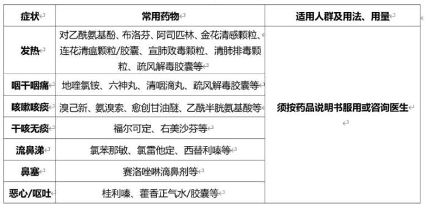

# 2022年疫情日记


|  日期   | 新增本土新冠确诊病例 | 无症状感染者  |
|  :----:  | :----:  |:----: |
| 20221201 | 26 |209 |
| 20221202  | 27 |264|
| 20221203 | 36 |450 |
| 20221204| 41|524 | 
| 20221205| 41|536 | 
| 20221206| 24|454 | 
| 20221207| 39|327 | 




今天早上去做核酸，风很大，我的心情也不好。

市疫情防控工作领导小组办公室发布优化调整疫情防控的相关措施，具体如下：
一、乘坐轨道交通、地面公交、轮渡等市内公共交通工具，不再查验核酸检测阴性证明。
二、全市公园、景区等室外公共场所，不再查验核酸检测阴性证明。

抓紧时间补仓。 网购 ，广东、保定、石家庄货源暂停。

社交媒体， 共存占主流，少数拒绝，评论也是。 攻击科兴疫苗的谣言很多。同时看到美国指责中国不购买美国疫苗的新闻。





上海疫情数据继续上涨。

今天看到一篇高福的采访稿， 信息量很大。全文引用 。

福寿园的股价又涨了。

上海已入冬！

网上关于共存的假消息很多，已经开始怀疑公布的阳性数据。都和保定，石家庄，广东有关。





高福 新冠鼻喷多肽药物进入二期临床，未来疫情防控清病不清毒 

12月4日，中国科学院院士、中科院微生物所研究员、中国疾控中心原主任高福向第一财经记者证实，他的团队开发的一款抗新冠多肽药物即将进入二期临床试验。

第一财经记者了解到，这款名为HY3000鼻喷雾剂的抗新冠多肽药物，是中科院微生物所与翰宇药业共同开发的，是国内首个获批临床的预防新冠肺炎感染的广谱多肽药物。

12月2日，HY3000鼻喷雾剂正式获得南方医科大学珠江医院医学伦理委员会临床试验审查批件。高福表示，一期临床研究数据显示，这款药物具备高活性、高抗病毒效果，兼具广谱性和安全性。

随着国家进一步优化疫情防控工作的“二十条”措施出台，目前各地都开始实施推进优化细则。高福对第一财经记者表示：“新冠疫情防控二十条措施当中，我认为最重要的就是强调精准防控，号召大家把疫苗和药物准备好。”

在新冠疫情三年中，高福一直呼吁科学家和疾控部门需要花更多时间来培育公众的认知。“在应对疫情的过程中，科学循证、公众理解和参与以及行政决策三者不可缺一。”他对第一财经记者表示，“公共卫生事件的处理要有科学基础，而行政决策必须要务实。”

高福表示，两年前科学家们就已经预测“新冠病毒不会消失”，未来疫情防控的目标将强调“清病不清毒”。“也就是我们要把新冠疾病尽量控制住，而不是把病毒清除掉。”高福说道，“未来抗疫我们要坚持小步走不停步。”

他还强调，未来抗原检测试剂将会得到更广泛的应用。12月2日，中科院微生物所与江苏美克医学共同研发的一款新冠抗原检测试剂产品获得上市批复。

在总结应对新冠大流行中疫苗、抗体和药物的研发经验时，高福坦言：“我觉得一个从事基础 (科学) 研究的科学家同样可以做出解决实际 (技术) 问题的实用工作，如果能有产业部门 (工程) 的合作，一定可以做出解决国计民生问题的产品与商品。”

他提出，科学家有了基本的科研想法后，应该大胆提出“假说”，根据“假说”设计“实验”，验证想法，再基于实验结果形成初步的产品“概念”，发表论文，经同行评审后，再将其转化为“技术”和“样品”，如果样品被市场看好，可进一步与企业合作，获监管部门认可后，可形成最终的“产品”，进入市场，参与竞争，优胜劣汰，服务社会、造福人类。

高福还鼓励更多科学家和病毒学家投身于科普，把科学知识传播给大众，预防“信息流行病”。“相比新冠流行病而言，信息流行病的危害性更大。”他对第一财经记者表示。





台湾出现第二例人感染新型猪流感(H1N2v)病例，确诊者为一名7岁女童 ，又是RNA病毒。
调查指近八成上海老年人掌握了网上买菜、打车、挂号等知识和技能。
政府号召层层减码，每一层码后面都有一家公司， 现在开始重分配，定标准了。
人民币回6，十年期国债收益率升高。
万泰生物鼻喷能防BF7，反正看不到数据。
昨天看新闻，上海公共卫生临床中心推荐贵州百灵，今天去药店买了些药，百灵的咳嗽药水不在医保里。
中国物流与采购联合会：11月全球制造业PMI为48.7% ,这个能是政策转向的原因。
北京防疫政策继续放松，上海也在放松，我们小区核酸也通知不做了。社交媒体上看到北京透析群体表示焦虑，有批评胡锡进的声音，有对保定躺平态度不同的表达。





上海的数字，已经没有意义。 今天看到新闻，北京已经有小儿惊厥， 全家阳，专家说，流感小孩也会有高烧。 

从澳门发布的防疫政策看国家防疫政策， 逐步放宽；老人疫苗；清病不清毒；不允许出现大规模感染 ；健康的第一责任人。

我有种感觉，上海不会春节爆发吧。。。

国家新能源汽车补贴将终止退出。

个税专项附加扣除增加到7项了.

国务院联防联控机制发布《关于进一步优化落实新冠肺炎疫情防控措施的通知》 联防联控机制综发〔2022〕113号





上海的数据竟然降了。
习近平抵达利雅得出席首届中国－阿拉伯国家峰会、中国－海湾阿拉伯国家合作委员会峰会并对沙特进行国事访问 .了不起的大事，这两年国内不会太平静。
大众安徽首台预量产车型下线， 合肥和合肥周边，都是好地方。
万泰的鼻喷，昨天晚上看到， 大失所望，只能和针剂组合使用。
全国各地继续减码，也许社交媒体里混了不少假新闻，还是要做好个人防护。
今天去大菜场，花了1000多，把香肠，肉糜，排骨全都备齐，少数人不戴口罩且卫生习惯不好。 
看了新闻报道，当前为上海窗口期。。。





　　新冠病毒感染者居家治疗指南

　　一、适用对象

　　(一)未合并严重基础疾病的无症状或症状轻微的感染者。

　　(二)基础疾病处于稳定期，无严重心肝肺肾脑等重要脏器功能不全等需要住院治疗情况的感染者。

　　二、家居环境要求

　　(一)在条件允许情况下，居家治疗人员尽可能在家庭相对独立的房间居住，使用单独卫生间。

　　(二)家庭应当配备体温计(感染者专用)、纸巾、口罩、一次性手套、消毒剂等个人防护用品和消毒产品及带盖的垃圾桶。

　　三、管理要求

　　(一)社区(村)和基层医疗卫生机构工作要求。

　　1.建立联系。发挥各地疫情防控社区(基层)工作机制的组织、动员、引导、服务、保障、管理重要作用。基层医疗卫生机构公开咨询电话，告知居家治疗注意事项，并将居家治疗人员纳入网格化管理。对于空巢独居老年人、有基础疾病患者、孕产妇、血液透析患者等居家治疗特殊人员建立台账，做好必要的医疗服务保障。

　　2.给予指导。居家治疗人员根据说明书规范进行抗原检测，必要时可请基层医疗卫生机构给予指导。基层医疗卫生机构对有需要的人员给予必要的对症治疗和口服药指导。

　　3.协助就医。社区或基层医疗卫生机构收到居家治疗人员提出的协助安排外出就医需求后，要及时了解其主要病情，由基层医疗卫生机构指导急危重症患者做好应急处置，并协助尽快闭环转运至相关医院救治。要以县(市、区)为单位，建立上级医院与城乡社区的快速转运通道。

　　4.心理援助。以地市为单位建立畅通心理咨询热线。基层医疗卫生机构和社区要将心理热线主动告知居家治疗人员，方便其寻求心理支持、心理疏导帮助。对于发现的心理或精神卫生问题较严重者，可向本地(市、县)精神卫生医疗机构报告，必要时予以转介。

　　5.个人防护。与居家治疗人员接触时，应当做好自我防护，尽可能保持1米以上距离。

　　(二)居家治疗人员自我管理要求。

　　1.健康监测和对症治疗。居家治疗人员应当每天早、晚各进行1次体温测量和自我健康监测，如出现发热、咳嗽等症状，可进行对症处置或口服药治疗。有需要时也可联系基层医疗卫生机构医务人员或通过互联网医疗形式咨询相关医疗机构。无症状者无需药物治疗。居家治疗人员服药时，须按药品说明书服用，避免盲目使用抗菌药物。如患有基础疾病，在病情稳定时，无需改变正在使用的基础疾病治疗药物剂量。

　　2.转诊治疗。如出现以下情况，可通过自驾车、120救护车等方式，转至相关医院进行治疗。

　　(1)呼吸困难或气促。

　　(2)经药物治疗后体温仍持续高于38.5℃，超过3天。

　　(3)原有基础疾病明显加重且不能控制。

　　(4)儿童出现嗜睡、持续拒食、喂养困难、持续腹泻或呕吐等情况。

　　(5)孕妇出现头痛、头晕、心慌、憋气等症状，或出现腹痛、阴道出血或流液、胎动异常等情况。

　　3.控制外出。居家治疗人员非必要不外出、不接受探访。对因就医等确需外出人员，要全程做好个人防护，点对点到达医疗机构，就医后再点对点返回家中，尽可能不乘坐公共交通工具。

　　4.个人防护。居家治疗人员要做好防护，尽量不与其他家庭成员接触。如居家治疗人员为哺乳期母亲，在做好个人防护的基础上可继续母乳喂养婴儿。

　　5.抗原自测。居家治疗人员需根据相关防疫要求进行抗原自测和结果上报。

　　6.感染防控要求。

　　(1)每天定时开门窗通风，保持室内空气流通，不具备自然通风条件的，可用排气扇等进行机械通风。

　　(2)做好卫生间、浴室等共享区域的通风和消毒。

　　(3)准备食物、饭前便后、摘戴口罩等，应当洗手或手消毒。

　　(4)咳嗽或打喷嚏时用纸巾遮盖口鼻或用手肘内侧遮挡口鼻，将用过的纸巾丢至垃圾桶。

　　(5)不与家庭内其他成员共用生活用品，餐具使用后应当清洗和消毒。

　　(6)居家治疗人员日常可能接触的物品表面及其使用的毛巾、衣物、被罩等需及时清洁消毒，感染者个人物品单独放置。

　　(7)如家庭共用卫生间，居家治疗人员每次用完卫生间均应消毒；若居家治疗人员使用单独卫生间，可每天进行1次消毒。

　　(8)用过的纸巾、口罩、一次性手套以及其他生活垃圾装入塑料袋，放置到专用垃圾桶。

　　(9)被唾液、痰液等污染的物品随时消毒。

　　四、结束居家治疗的条件

　　如居家治疗人员症状明显好转或无明显症状，自测抗原阴性并且连续两次新冠病毒核酸检测Ct值≥35(两次检测间隔大于24小时)，可结束居家治疗，恢复正常生活和外出。

　　五、保障要求

　　(一)各地疫情防控领导机制中负责社区(基层、农村)工作的牵头单位要充分发挥作用，切实担当负责。基层医疗卫生机构建立24小时值班制度，指定专人承担感染者居家治疗健康咨询工作。社区(村)安排做好核酸检测、垃圾清运、环境消杀等工作，并及时发现和解决问题。

　　(二)要组织医疗机构，通过远程指导、互联网医疗等线上+线下相结合的方式，为居家人员提供康复指导支持和心理支持，基层医疗卫生机构通过互联网等多种方式加强对辖区居家康复人员的巡查指导和健康监测，二、三级医院要通过远程医疗的方式为基层医疗机构提供会诊指导。

　　(三)各地要加强基层医疗卫生机构常用药品、抗原检测试剂、指夹式血氧仪等储备，切实满足居家治疗人员用药和健康监测需求。

　　(四)医疗机构要严格落实首诊负责制和急危重症抢救制度，不得以任何理由推诿或拒绝居家治疗的新冠病毒感染者特别是急危重症患者到医疗机构就诊。

    附件1

　　新冠病毒感染者居家治疗常用药参考表

    

　　附件2

　　新冠病毒感染者居家治疗抗原检测指南

　　一、检测试剂获得

　　1.居家治疗人员可通过药品网络销售电商等购买抗原检测试剂，也可通过所在的社区(村)或辖区基层医疗卫生机构协助购买抗原检测试剂。

　　2.社区(村)和基层医疗卫生机构要为辖区内有需求的居家治疗人员，特别是老年人，提供获得抗原检测试剂的便利。

　　二、检测和结果判读

　　1.居家治疗人员可以按照说明书要求和流程自行进行检测和结果判读，也可以联系基层医疗卫生机构签约服务医务人员，在其远程指导下完成检测和结果判读。

　　2.养老机构工作人员要在有需要时，按照说明书要求和流程为养老机构内的老年人进行抗原检测和结果判读。



