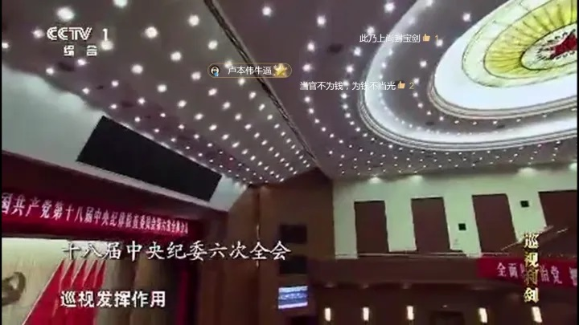

# 00后的牛逼文化

00后的牛逼文化来源何处 ？

2017年直播平台资本造神，捧红了卢本伟，卢本伟牛逼一炮而红,成为当年的直播界一哥 。不得不承认， 现在牛逼文化成了网红文化的代名词。 牛逼没问题，守法即可， 但网红最缺的是对法律对社会的敬畏之心，卢本伟也因此消失。

其实，回顾以前，同样的事情在我身边也一再发生过。我的舅舅在我眼里是个好人，上世纪80年代生长在码头边上，当时崇拜的是港台黑道文化， 结伙打架， 判了2年，出来以后在港务局做了一辈子临时工，退休返聘还是临时工。。。 我自己大学的时候碰到以前的混子同学，他们全都是表示后悔没读大学。

习近平主席在2023年新年贺词里说，“中国这么大，不同人会有不同诉求，对同一件事也会有不同看法”，这是社会阶层的另一种表达方式。不同的阶层，他们价值取向，消费方式，行为模式，对待新事物的看法，都不同。 00后，比以往更复杂， 他们有网红，二次元， LGBT , BL, 女拳等各种团体，缺的是脚踏实地。 借最早的网红侯德健的一首歌， 三十以后才明白 ，表达一下自己的心情， 三十以后才明白，那就有点晚了。（注，侯德健已经回过大陆，不要说你不知道）
