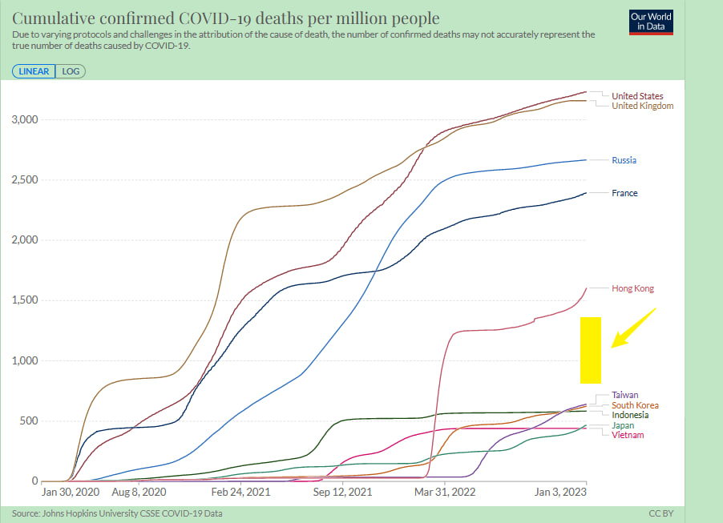

# 2023年日记-1



地缘冲突未消、大国博弈激烈、安全危机频仍，进入2023年，全球和平赤字、安全赤字、信任赤字、治理赤字，有增无减。

国家主席习近平发表二〇二三年新年贺词 。

广州黄埔区知识城方舱医院将改造成亚定点医院 .

新年第一天，蒙脱石散登上微博热搜.有多张网传截图显示，奥密克戎亚型毒株XBB1.5毒株已在国外部分地区成为优势毒株，主要攻击心脑血管和拉肚子，让有条件的准备蒙脱石散等药品。

俄军扩军令生效.





一张“关于XBB.1.5毒株在美国登顶，大家要囤点蒙脱石散、整肠生、诺氟沙星”的截图在网络流传，不少药物一度脱销，“未成年人禁止服用诺氟沙星”一度冲上热搜.

辟谣，2023年的第一件大离谱！全国被一个修打印机的忽悠了，蒙脱石散一夜脱销 。

上午接到父亲的电话，2道杠，昨天开始发热38°，血氧95， 心跳比平常快了1倍，昨天晚上嗓子疼。 母亲现在1道杠。 母亲目前开始出现症状 ，38.2° 血氧96 脉搏108 ，头昏，骨头酸疼。 我父母最近都不出门，只有我送东西过去，我看看这两天我会不会出问题。 

“实践是检验真理的唯一标准”主要作者胡福明去世，享年87岁。





父亲昨天晚上反应激烈上吐下泻大汗淋漓几乎虚脱。 36.3，97， 78 .  这个反应正常， 有抵抗力。 叮嘱药吃7天。

母亲 37.2，91 ，78 ， 因为母亲偏胖 。 如果明天血氧不行，就准备去医院。

按照疾控中心数字， 重症病例数字开始下降。

金正恩携女儿视察可载核弹头导弹库。

南京大屠杀幸存者马庭禄去世 在册在世幸存者仅存49位。

离岸人民币汇率非常凶。

12月财新中国制造业PMI降至49.0 为三个月来最低。

重磅！郑州出台户籍制度改革新政.

上港集团1月1日发布快速统计数据，2022年，上海港集装箱吞吐量突破4730万TEU(标准箱)大关，连续第13年蝉联全球第一。

新冠重症概率高不高？北京、上海等地救治情况如何？ 全文引用。





当前，各地新冠病毒感染人数增加。重症发生率高不高？救治情况如何？怎样预防重症？记者采访了相关专家。

新冠病毒导致重症概率高不高？

“现阶段，感染者以轻症为主，部分为普通型，少数高龄老人和患严重基础病的发展为重症和危重症。”中国工程院院士李兰娟分析，当前，我国流行毒株为奥密克戎变异株，因毒株传染性极强叠加人口基数巨大，感染人数比较多。奥密克戎变异株致病力较原始毒株和德尔塔毒株明显下降，感染者中轻型和无症状占绝大多数。轻症病例肺部影像正常，无肺炎表现，症状以发热、乏力、全身酸痛以及咽痛、咳嗽等上呼吸道症状为主，部分患者伴有腹泻等消化道症状。大部分人3至5天体温能恢复正常，其他症状逐渐改善。

“北京定点医院目前收治的感染者中，重症、危重症占比为3%至4%。”负责北京两家定点医院的重症、危重症患者救治工作的首都医科大学附属北京朝阳医院副院长童朝晖介绍，来就诊的患者大部分都是普通型。

四川大学华西天府医院院长康焰介绍，近3周以来，天府医院ICU累计收治了46名重症患者，占有症状感染者1%左右。从就诊的情况看，最近发热门诊每天有约450名就诊患者，其中需要入院治疗的大概占有症状感染者10%。

“尽管奥密克戎变异株致病力下降，但因为感染者基数庞大，重症绝对人数也不容忽视。”复旦大学附属华山医院感染科主任张文宏说，像上海这样的城市，高龄老人和有基础病的脆弱人群绝对数不小，即便感染成为重症的比例很低，也会给医院重症资源造成很大压力。

所谓“白肺”是重症肺炎的表现之一。中国医科大学附属第一医院重症医学科主任马晓春说，新冠病毒感染造成的重症肺炎主要表现为急性呼吸衰竭。从CT影像上看，当肺部损失比例很高，才会表现为白肺，并不是只要出现肺炎就是白肺。出现白肺的患者往往是危重症患者，这部分人在所有新冠患者中占比很低。

导致重症肺炎并出现白肺的因素不只是感染新冠病毒。西安交通大学第一附属医院感染科主任何英利介绍，过去，医院也会收治一些白肺患者。冬季感染流感病毒、细菌、支原体等病原体都可能导致重症肺炎。高龄老人、基础疾病患者、重度吸烟者感染新冠病毒后，更容易发展为重症甚至危重症。

哈尔滨医科大学副校长、哈尔滨医科大学附属第一医院院长于凯江说，65岁以上的老年人，有心脑血管疾病、慢性肺部疾病、糖尿病、慢性肝脏、肾脏疾病等基础疾病者，免疫功能缺陷患者和重度吸烟者，是重症肺炎的高危人群。

重症患者能否得到有效治疗？

3年来，在救治新冠重症和危重症患者的过程中，我国积累了大量经验和救治资源，也锻炼了一大批战斗力强的重症医护队伍。

童朝晖说，目前，我国救治方案已经更新到第九版，对重症、危重症患者，从预防到治疗都有比较完整的方案，包括中西医结合治疗的方案，经过3年临床检验，已经很成熟，对收治的重症患者能够快速、有效救治。3年当中，各家医院的重症、呼吸、感染等科室医生都在临床实际救治中积累了比较好的经验。

复旦大学附属中山医院重症医学科主任钟鸣介绍，对于新冠重症和危重症患者救治，首先采取早期抗病毒的治疗，比如使用一些小分子的抗病毒药物，同时根据病情的需要合理使用糖皮质激素。对于呼吸衰竭的患者，使用呼吸支持的一些设备，比如呼吸机、高流量氧疗和ECMO等设备，对患者进行呼吸支持。加强对症治疗，比如对休克的患者进行补液，使用血管活性药物，同时进行营养支持治疗等。

中医药积极参与重症、危重症救治。广东省名中医、广州中医药大学第一附属医院大内科主任吴伟说，中医药在疫情发生以来显示出确凿的临床疗效和特色优势。我国总结出来的“三方三药”以及各地中医、中西医结合的经验表明，轻型、普通型单纯以中医药治疗就有效，并可以阻止向重型转变。重型、危重型中西医协同治疗也取得较好的效果。

重症、危重症患者的治疗效果如何？是否有后遗症？

李兰娟介绍，从目前临床病例治疗来看，多数患者预后良好，极少数有基础疾病的患者恢复后可能存在肺纤维化。做到“尽早发现、尽早治疗”，绝大部分患者都不会留下后遗症。

马晓春介绍，患者在ICU能得到规范的治疗，绝大部分患者预后都还不错，除了一些特别高龄的、有严重基础疾病的患者。从3年的临床观察看，无论是从肺功能上看，还是影像学上看，患者预后情况良好，肺部有残留明显损害的情况极少。

“目前来看，全国总体床位资源和设备资源能够满足重症患者救治需求。”国家卫健委医政司司长焦雅辉说，全国重症医学床位总数是18.1万张，平均10万人有12.8张，其中，三级医疗机构的重症医学床位数是13.34万张，可转换ICU的床位是10.48万张，二级以上医疗机构重症床位的使用率平均在50%左右波动。

个人如何保健康防重症？

当前，我国疫情防控进入新阶段，工作重心从“防感染”转向“保健康、防重症”。广大老年人、慢病患者如何做好自我防护，一旦感染新冠病毒如何避免发生重症？

应对重症，关键在预防。广州医科大学附属第一医院党委书记黎毅敏说，高龄老人、基础疾病患者等脆弱人群是重症的高发人群。这类人群要加强预防，把基础疾病治疗好、控制好，做到规律用药、合理膳食、适量运动、保持良好心态。

张文宏表示，营养是救治感染者的基础，怎样强调都不过分。呼吁养老院、居家老人，一定要千方百计保证老年人优质蛋白摄入，做到营养多样化，保持蔬菜、碳水均衡，增强老年人自身的抵抗力。

脆弱人群要做好个人防护。中南大学湘雅医院重症医学科主任张丽娜说，尽量避免前往人群密集场所，尤其是密闭式场所。外出时佩戴口罩，最好是N95口罩，加强手卫生。与人接触时，保持“一米线”安全社交距离。如果同居的人感染后，也要做好隔离措施，戴好口罩，单间居住，不共餐，有条件的不共用卫生间。

钟鸣介绍，全程接种疫苗之后，高龄老人的重症率和死亡率有显著下降。在临床救治中发现，全程接种疫苗的人群，康复的概率比完全没有接种疫苗和没有全程接种疫苗的人群概率要高。

居家老年人一旦感染新冠病毒，出现什么体征需要就医？武汉大学中南医院呼吸与危重症医学科主任程真顺说，老年人感染后，如果发热时间太长，出现呼吸困难，胸闷，监测血氧饱和度下降，且低于93时，就应及时到医院就诊。早预警、早发现、早治疗能有效控制病情发展，减少重症的发生。

家人或陪护人员做好老人的健康监测非常重要。童朝晖表示，老年人肺炎起病比较隐匿，没有明显症状，也就是说不能按通常的肺炎、发烧、咳嗽、咳痰等年轻人的症状来观察老人。如果老人感染后出现食欲减退、爱睡觉、打不起精神，病情可能加重。此时，家人或陪护人员要仔细查看老人呼吸频率是否加快，是否喘气，有没有出现胸闷等症状。如果答案是肯定的，要及时送去医院就诊，防止病情加重。

“寒冷季节加上新冠病毒感染，慢阻肺、支气管扩张等慢性呼吸道疾病患者发病多，病情可能加重，出现肺炎。”童朝晖说，这类患者如果出现病情急性加重，需要吸氧，建议在家里设置氧疗设备。要坚持用药，天气寒冷时最好不外出，有利于减少病情发作次数。新冠病毒、感冒、流感、细菌感染等都会导致慢阻肺加重，如果出现发烧和肺炎的症状，要及时住院治疗，以防出现重症肺炎。





特斯拉股价重挫12%！明星科技公司拖累，美股新年首日收跌.

中国A股2023年取得“开门红”。

上合跨境人民币服务中心在山东青岛揭牌成立 。

国铁集团：2022年开行中欧班列1.6万列、发送160万标箱。

今天公布的疾控中心数据看， 重症还在爬坡 。。。

父亲 第四天 37.2  94  69  ， 咽喉痛， 无力 。 老头子不听劝，开始停药，嘴上说新冠不是感冒， 恢复思路还是治感冒的思路。
母亲 第三天 38.3 94 84 。

晚上 ，  父  37.1  96  93  ，母  37.1  95  51  . 





美国众议院议长选举进入第四轮投票 麦卡锡仍失利。

渣打中国成为首家获准参与国债期货交易的在华外资银行。

互联网出现 XBB恐慌症。

母 36.5 94 73 ，父 36.6 96 62  。

自己研究的超额死亡数字。

 

1月8日起，上海轨道交通所有车站不再对进站乘客进行测温.

深圳市人民政府口岸办公室5日发布公告指出，深港口岸于2023年1月8日起，分阶段有序恢复内地与香港人员正常往来.





母 36.5  97   63
父 37.7  95   71

晚上  

母 37.0  95   90
父 38.0  95   61

2022-23赛季CBA常规赛第三阶段起恢复主客场制 .

“乙类乙管”后第一个春运将开启。

国家邮政局：全国快递员上岗率已达94.9% 。

今年春运从1月7日起至2月15日，预计我市对外交通到发总量2607万人次。

银行理财净值回升 机构看好后市机会 。

昨天看了比亚迪仰望U8、U9的视频， 相当惊艳。





1月8日起，上海市核酸检测不再延续免费政策。

上海市将新冠治疗相关药品临时纳入医保报销范围，扩大医保个人账户使用范围。

2023年1月8日零时起，上海市将调整入境人员相关管理措施 。

上海市级专家组132名专家指导基层一线加强重症预防与救治。

经研究，国家卫生健康委办公厅、民政部办公厅、公安部办公厅《关于印发新型冠状病毒感染的肺炎患者遗体处置工作指引（试行）的通知》.

马云不再为蚂蚁集团实控人，表决权由53.46%降为6.2%.

嘉定已有8价社区卫生服务中心增配CT设备。

两岸“小三通”客运航线部分恢复通航.





市医保局介绍，本市将新冠治疗相关药品临时纳入医保报销范围，扩大医保个人账户使用范围，将一批新增发热诊间紧急纳入医保定点，支持患者在互联网医院就诊，优化“一老一少”代配药机制，切实满足患者就医用药需求，减轻患者医药费用负担。详见↓

着力减轻新冠病毒感染患者医药费用负担

临时扩大医保用药目录。按照国家医保局要求，将符合诊疗方案的近百种新冠药品，全部纳入本市医保报销范围，包括奈玛特韦片/利托那韦片（paxlovid）、安巴韦单抗注射液、罗米司韦单抗注射液、阿兹夫定片等。同时对医疗机构明确，抗新冠病毒小分子药物发生的费用全额按实单列支付，保障临床用药需求。

拓宽医保个人账户适用范围。为支持新冠病毒感染患者居家治疗，拓宽医保个人账户使用范围，参保人在全市1538家定点零售药店，均可用医保个人账户购买新冠治疗相关药品、新冠病毒抗原检测试剂盒、医用防护口罩等。

开通新冠药品采购“绿色通道”。在“上海阳光医药采购网”，对新冠治疗相关药品开通直接挂网采购“绿色通道”。目前已公布7批共计78个快速挂网的药品。2022年12月1日至今，包括解热镇痛类药品布洛芬、对乙酰氨基酚及缓解相关症状的常用药，紧急采购总金额达6.8亿元。

更好满足新冠病毒感染患者就医需求

新增发热诊间紧急纳入医保定点。为进一步满足新冠病毒感染患者就医需求，仅2天时间，将全市社区卫生服务机构新设立的2594个发热诊间，以及全市231家养老院内设医疗机构，全部实现医保拉卡结算。

家庭医生签约人员在社区卫生服务中心和村卫生室就诊可减免诊查费，报销比例也高于二、三级医疗机构（职保退休人员可达90%）。仅4天时间，各社区卫生服务机构的发热诊疗人数从12月19日占全市发热诊疗量的5%以下，增长到23日的50.2%，满足了患者就近就医配药需求。

不断优化患者线上线下就医购药体验

150家互联网医院实现就医医保直接结算。符合《新冠病毒感染者居家治疗指南》条件的患者，可通过互联网医院在线就诊配药，并纳入医保结算。目前，全市支持医保结算的互联网医院共150家，其中32家机构还可以通过互联网医院为门诊大病患者提供在线复诊。除互联网医院交易外，2022年全市支持医保移动端支付的医疗机构420家，有效缓解医院窗口聚集排队付费的情况。

亲属及志愿者代配药实现无障碍。为保障 “一老一少”特殊群体线上就诊配药，开通“亲属关系”校验渠道，生成“一老一少”随申亲属码，支持亲属为儿童（＜18周岁）与老人（≥60周岁）进行代配药，并通过亲属码医保授权完成医保支付。此外，通过医保授权，志愿者与老人本人的医保账户和待遇关联实现医保支付，减少特殊群体交叉感染风险。





全国铁路对儿童优惠票实行车票实名制管理。年满6周岁且未满14周岁的儿童可购买儿童优惠票。每一名成年旅客可免费携带一名未满6周岁且不单独占用席位的儿童乘车，超过一名时，超过人数应当购买儿童优惠票，儿童年龄按乘车日期计算。

学生优惠票不再规定乘车时间限制。学生旅客凭证件每学年任意时间可购买家庭居住地至院校（实习地点）所在地之间4次单程的学生优惠票。

持中华人民共和国残疾军人证、中华人民共和国伤残人民警察证、国家综合性消防救援队伍残疾人员证的人员凭证可以购买优待票。

视力残疾旅客可以携带取得导盲犬工作证，用于辅助视力残疾人工作、生活的导盲犬进站乘车。行动不便的老、幼、病、残、孕等特殊重点旅客可免费携带轮椅、折叠婴儿车进站上车。

酒精禁止进入铁路。旅客在旅途中如有消毒需求，可使用消毒湿巾、消毒棉片等替代。

消毒凝胶属于“含易燃成分的非自喷压力容器日用品”，在安检中是“限制随身携带的物品”，因此每位旅客限带1件，而且单体容器容积不能超过100毫升。






